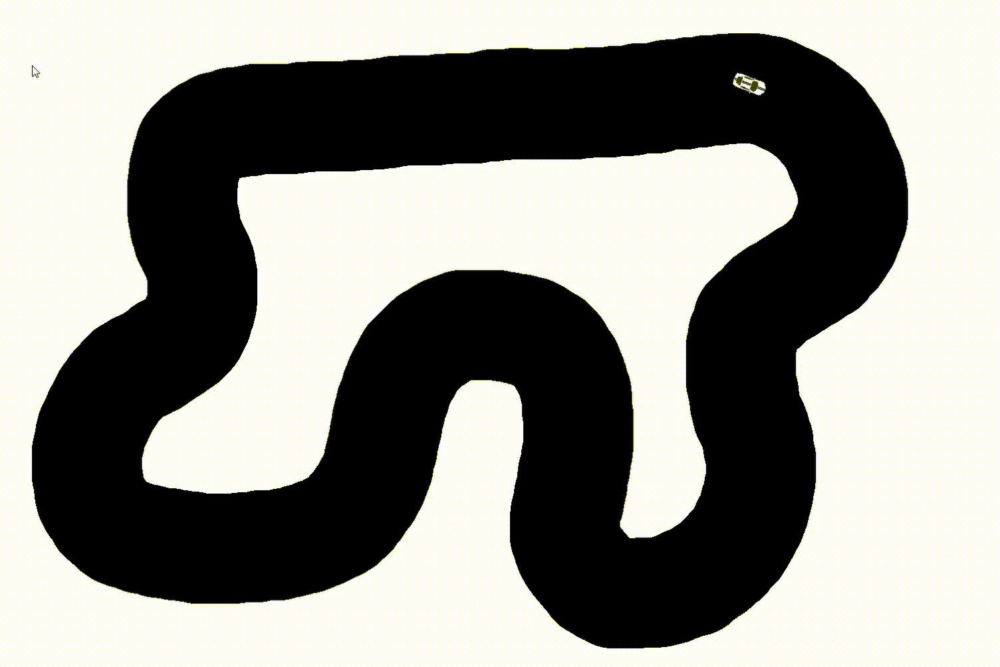

# self-driving-car
Using a neural net with a genetic algorithm to teach a virtual car to drive itself.

Courses are PNG files with black representing track, white representing walls, and a single red pixel representing the car's spawn point.

model1.pth represents a neural net that has learned how to ace course1, but fails at the harder course2. 

Change the designated variables in main.py to control the program (view a saved model, etc).

